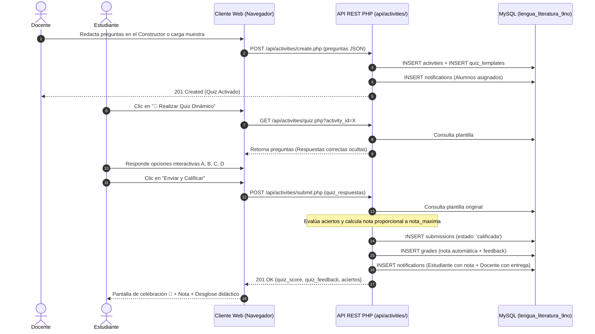

# 🏛️ Arquitectura del Proyecto: Lengua y Literatura 9.º EGB

Este documento describe la arquitectura técnica, los principios de diseño, el modelo de capas, los flujos de datos y la estrategia de despliegue de la plataforma educativa interactiva y de gestión académica de **Lengua y Literatura (9.º Año de Educación General Básica Superior)** de la **Unidad Educativa Fiscomisional San Lorenzo**.

---

## 1. Visión General y Estilo Arquitectónico

La plataforma adopta una **Arquitectura en Capas Full-Stack con Servicios REST Desacoplados**:
1. **Frontend Desacoplado:** Interfaces modulares basadas en HTML5, CSS3 estructurado en tokens de diseño y JavaScript moderno (ES6+), consumiendo la API de manera asíncrona mediante `fetch()`.
2. **Backend Ligero y Seguro (API REST en PHP 8):** Micro-servicios orientados a recursos que manejan la autenticación basada en sesiones de servidor seguras (`HttpOnly`, `SameSite=Lax`), autorización por roles (`admin`, `docente`, `estudiante`) y lógica de negocio.
3. **Persistencia Relacional Normalizada (MySQL / MariaDB):** Almacenamiento seguro con integridad referencial, encriptación de contraseñas con `bcrypt` y tipos de datos `JSON` para plantillas y respuestas de cuestionarios interactivos.

---

## 2. Modelo Arquitectónico de 4 Capas

```mermaid
flowchart TD
    subgraph CAPA_PRESENTACION["1. Capa de Presentación (Cliente / UI)"]
        UI_PORTAL["Portal Público\n(index.html, views/*.html)"]
        UI_LOGIN["Acceso Unificado\n(login.html)"]
        subgraph DASHBOARDS["Paneles de Control (dashboard/)"]
            D_ADMIN["Panel Administrador\n(Usuarios, Actividades, Comunicados)"]
            D_DOCENTE["Panel Docente\n(Constructor Quizzes, Tareas, Calificar)"]
            D_ESTUDIANTE["Panel Estudiante\n(Organización, Quiz Player, Notas)"]
        end
        UI_STYLE["css/style.css, dashboard.css, base.css"]
    end

    subgraph CAPA_CLIENTE_JS["2. Capa de Controladores de Cliente (js/modules/)"]
        M_AUTH["auth.js\n(Control de sesión y rutas protegidas)"]
        M_ACT["activitiesManager.js\n(Constructor de quizzes y gestión)"]
        M_GRADES["gradesManager.js\n(Quiz Player dinámico, filtros y métricas)"]
        M_USERS["usersManager.js\n(CRUD de usuarios del plantel)"]
        M_NOTIF["notifications.js\n(Polling en vivo de alertas)"]
        M_DATA["js/data/\n(Contenidos locales de 9no EGB)"]
    end

    subgraph CAPA_BACKEND_API["3. Capa de Servicios y API REST (api/)"]
        API_AUTH["/api/auth/\n(login.php, check.php, logout.php)"]
        API_ACT["/api/activities/\n(list, create, quiz, submit, update, delete)"]
        API_GRADES["/api/grades/\n(list, assign, student)"]
        API_USERS["/api/users/\n(list, create, update, delete)"]
        API_NOTIF["/api/notifications/\n(list, read, broadcast)"]
        CORE_SESSION["api/config/session.php\n(Control de sesión y requireRole)"]
    end

    subgraph CAPA_PERSISTENCIA["4. Capa de Persistencia (MySQL / MariaDB)"]
        DB_USERS["users (Credenciales bcrypt, rol)"]
        DB_ACT["activities (Tareas, ponderaciones)"]
        DB_QUIZ["quiz_templates (Preguntas JSON, respuestas)"]
        DB_SUB["submissions (Entregas, respuestas alumno)"]
        DB_GRADES["grades (Calificaciones, retroalimentación)"]
        DB_NOTIF["notifications (Alertas al usuario)"]
        DB_AUDIT["audit_logs (Trazabilidad de acciones)"]
    end

    %% Relaciones entre capas
    UI_PORTAL & UI_LOGIN & DASHBOARDS --> CAPA_CLIENTE_JS
    CAPA_CLIENTE_JS <--> |HTTP / JSON (fetch)| CAPA_BACKEND_API
    CAPA_BACKEND_API <--> |PDO MySQL| CAPA_PERSISTENCIA
    UI_STYLE -. Estiliza .-> CAPA_PRESENTACION
```

---

## 3. Flujo de Datos y Evaluación de Quizzes

Uno de los componentes más destacados de la plataforma es el motor de **quizzes interactivos con calificación automática**:



---

## 4. Principios de Seguridad Implementados

1. **Protección de Contraseñas:** Encriptación irreversible mediante `password_hash($pwd, PASSWORD_BCRYPT)` con coste por defecto.
2. **Prevención de Inyección SQL:** Todas las consultas hacia la base de datos se ejecutan con sentencias preparadas de PDO (`$db->prepare(...)` y vinculación estricta de parámetros `:placeholder`).
3. **Manejo Seguro de Sesiones:**
   - Parámetros de cookie configurados en `session.php`: `httponly = true` (previene robo por XSS) y `samesite = 'Lax'`.
   - Regeneración de ID de sesión (`session_regenerate_id(true)`) al autenticarse para prevenir ataques de fijación de sesión.
4. **Protección de Rutas y Autorización por Rol:**
   - En el backend: Middleware `requireAuth()` y `requireRole(['admin', 'docente'])` que retornan código HTTP 401 o 403 ante accesos no autorizados.
   - En el cliente: Módulo `Auth.requireRole()` que verifica con `/api/auth/check.php` antes de renderizar vistas privadas.
5. **Integridad Pedagógica:** El endpoint `api/activities/quiz.php` sanitiza los reactivos eliminando el atributo `answer` y la `explanation` antes de enviar el JSON a un estudiante que aún no ha entregado la prueba.
